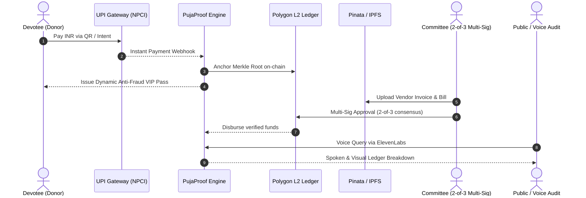

<div align="center">

  

  # PujaProof
  **Blockchain-Anchored Transparency & Crowdfunding for Community Festivals**  
  *Built for HackSpire '26 • Track: Blockchain — Dharma & Trust*
  <p align="center">
    
    
    
    
    
  </p>

</div>

---

## Overview

PujaProof brings financial transparency to India's ₹40,000+ Cr festival economy by combining **familiar UPI payments** with **blockchain-anchored proof-of-spend**. 

Contributors donate in INR using their everyday UPI apps. In the background, funds, multi-sig committee disbursements, and vendor invoices are verifiable on-chain and auditable via voice AI.

## Demo Video

* **YouTube:** [https://www.youtube.com/watch?v=N8KNEGeTdjQ](https://www.youtube.com/watch?v=N8KNEGeTdjQ&feature=youtu.be)

---

## Problem vs Solution

| Problem (Current Scenario) | PujaProof Solution |
| :--- | :--- |
| **Coercive Chanda:** Aggressive manual door-to-door cash collection. | **Voluntary Digital Giving:** Instant UPI donations with verifiable digital receipts. |
| **Cash Siphoning:** Unrecorded expenses and untracked vendor kickbacks. | **Proof-of-Spend:** Public ledger linking disbursements directly to IPFS vendor bills. |
| **Unilateral Spending:** Single organizers withdraw or misallocate funds. | **2-of-3 Multi-Sig Treasury:** Requires Treasurer + Secretary consensus for payouts. |
| **Pass Forgery:** Paper tickets easily counterfeited and scalped. | **Dynamic QR Passes:** Single-scan, time-rotating anti-fraud VIP credentials. |
| **Buried Accounts:** Financial logs hidden or difficult to inspect. | **ElevenLabs Voice AI:** Natural spoken financial audits in regional languages. |

---

## Key Features

* **Zero-Crypto UPI Rail:**
  * Pay via GPay, PhonePe, or Paytm in INR.
  * No crypto wallets, seed phrases, gas fees, or volatility risk for donors.

* **Dual-Layer Architecture:**
  * Fast fiat payment settlement on Web2 rails.
  * Batched Merkle root anchoring on Polygon / Arbitrum L2 for immutable proof.

* **Proof-of-Spend Multi-Sig Treasury:**
  * Committee expenses require a **2-of-3 signature threshold** (Treasurer, Secretary, President).
  * Every withdrawal links directly to a tamper-proof vendor invoice on IPFS (Pinata).

* **Anti-Fraud Dynamic VIP Passes:**
  * Tiered rewards: Supporter badges, priority-darshan passes, sponsor access.
  * Scan-once dynamic QR codes prevent duplicate entry and black-marketing.

* **Voice-First Civic Auditing (ElevenLabs):**
  * Multilingual conversational AI (English, Hindi, Bengali).
  * Voice query examples:
    * *"How much money has been raised so far?"*
    * *"What was spent on lighting and sound?"*
    * *"Show me the verified vendor invoices."*

---

## System Flow



---

## Tech Stack

* **Frontend:** Next.js 16 (Turbopack), React 19, Tailwind CSS
* **Voice AI:** ElevenLabs Conversational SDK & ElevenAgents
* **Database:** Turso Cloud (LibSQL / SQLite)
* **Blockchain & Trust:** Polygon / Arbitrum L2, Solidity, Hardhat, Ethers.js
* **Storage:** Pinata / IPFS (Decentralized Invoice & Bill proofs)
* **Payments:** NPCI UPI Protocol (PhonePe / GPay / Paytm)

---

## Repository Structure

```
PujaProof/
├── lander/         # Landing portal & Turso-backed waitlist
│   ├── src/app/    # Next.js app routes (/waitlist, /api/waitlist)
│   ├── public/     # Logos & visual assets
│   └── .env        # Turso Cloud DB credentials
├── mvp/            # Interactive transparency dashboard prototype
│   └── src/        # Campaign management & pass scanner
├── plan.txt        # HackSpire '26 specification document
└── README.md       # Project documentation
```

---

## Quick Start

```bash
# 1. Clone repository
git clone https://github.com/nikhil-chourasia/PujaProof.git
cd PujaProof/lander

# 2. Configure Environment
cp .env.example .env
# Fill in TURSO_DATABASE_URL and TURSO_AUTH_TOKEN

# 3. Install & Run
npm install
npm run dev
```

Open [http://localhost:3000](http://localhost:3000) for the landing page or [http://localhost:3000/waitlist](http://localhost:3000/waitlist) for the waitlist portal.

---

## Team Poppins

* **Nikhil Chourasia** — Product Lead & Fullstack Engineer
* **Ankit Raj** — Web3 & Backend Engineer

<div align="center">
  <sub>HackSpire '26 • Team Poppins</sub>
</div>
